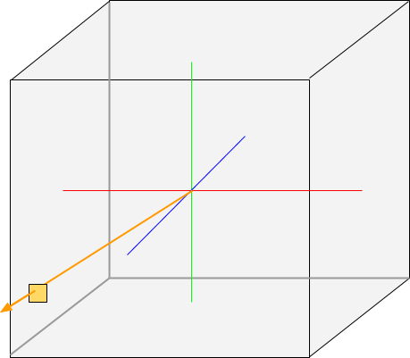
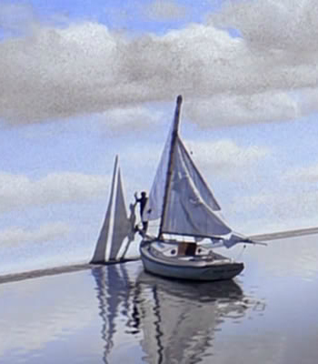

<table cellspacing="0" cellpadding="0"><tbody>
<tr valign="top"><td width="60%" colspan="2">

# Volcano Sample 10: Cube Maps and Image Arrays

This sample renders a cube map and an image array.

</td></tr><tr valign="top"><td width="60%">

[View source code](./)

1. [Goals](#goals)
1. [Where to Get a Cubemap on the Internet](#where-to-get-a-cubemap-on-the-internet)
   1. [HDR Tone Mapping](#hdr-tone-mapping)
   1. [Definition of Cube Map](#definition-of-cube-map)
   1. [What the Vertex Shader Does](#what-the-vertex-shader-does)
   1. [Spherical Panorama to Skybox](#spherical-panorama-to-skybox)
      1. [Definition of Skybox](#definition-of-skybox)
   1. [Implementing a Skybox](#implementing-a-skybox)
1. [Image Array](#image-array)
1. [The End](#the-end)

</td><td width="40%">


This sample is not automatically built.

Build it by typing:<br/>
`vendor/subgn/ninja -C out/Debug 10cubemap`

Run it by typing:<br/>`out/Debug/10cubemap`

Vulkan Validation layers are enabled by setting the `VK_INSTANCE_LAYERS`
environment variable.</td></tr>
</tbody></table>

## Goals

By the end of this sample, hopefully you feel like you know how to:

1. Pick a photo from the internet to use
1. Tell the difference between a spherical panorama, cubemap, and skybox
1. Convert between them
1. Create an app that renders a skybox using a cubemap

## Where to Get a Cubemap on the Internet

A cube map is a panoramic photo that has been exported as the six faces of a
cube. The cube map in this sample is a CC0 image from
[hdrihaven.com](https://hdrihaven.com). Consider donating to
[hdrihaven.com](https://hdrihaven.com) if you like this sample.

### HDR Tone Mapping

Files from that site are .hdr files (RGBE format). To convert it to a .jpg,
try
[LuminanceHDR](https://sourceforge.net/projects/qtpfsgui/).

Converting from .hdr to a screen-viewable format is known as
["tone mapping."](https://learnopengl.com/Advanced-Lighting/HDR)
Take some time to play around with a panorama in
[LuminanceHDR](https://www.flathub.org/apps/details/net.sourceforge.qtpfsgui.LuminanceHDR)
and see how a single .hdr file can be rendered in various ways on-screen.
This is because display panels don't produce light as powerfully as the sun or
have the same effect on human eyes.

A panoramic photo like this can be rendered to a cube map.

### Definition of Cube Map

A cube map is 6 textures in a convenient format for GPUs. The result of tone
mapping is still a spherical panorama. A spherical panorama is a sphere of
texels where the viewer is placed at the center. Since the GPU doesn't handle
spheres natively, your app can either:

1. Generate enough polygons to make an approximate sphere.
1. Convert the spherical panorama into something else.

It turns out you can get "enough polygons" by just drawing the 6 faces of a
cube:



The GPU will accept a single vector (the orange arrow above) and pick from 6
different textures automatically, as if they were arranged as a cube.

The GPU returns the sample at the location given by the point where the
orrange arrow hits the cube, represented by the orange square. Call `texture()`
to access your cube map:

```C++
// Fragment shader
#version 450

// Specify outputs. location = 0 references the index in
// VkSubpassDescription.pcolorAttachments[].
layout(location = 0) out vec4 outColor;

// Specify inputs.
layout(location = 0) in vec3 cameraDirection;

// Specify bound textures. "samplerCube" is a cube map - compare to a
// "sampler2D" which is a normal 2D texture.
layout(binding = 1) uniform samplerCube sampler;

void main() {
  outColor = texture(sampler, cameraDirection);
}
```

An easy way to see the difference between a cube map and a `sampler2D` is:

1. Bind a 2D image to a `sampler2D`. Sample it with a `vec2 uv` in your
   fragment shader:

   `outColor = texture(theSampler2D, uv)`

1. Bind six 2D images to a `samplerCube`. Sample it with a
   `vec3 cameraDirection` in your fragment shader:

   `outColor = texture(theSamplerCube, cameraDirection);`

### What the Vertex Shader Does

The vertex shader calculates the `vec3 cameraDirection` (orange arrow above)
and sends it to the fragment shader. `cameraDirection` is computed as the
cube's vertices. (Remember that the vertex shader output is interpolated,
so each fragment shader invocation will get a value somewhere in between the
vertices of the cube.)

```C++
// Vertex shader
#version 450

// Specify outputs.
out gl_PerVertex {
  vec4 gl_Position;
}
layout(location = 0) out vec3 cameraDirection;

// Specify inputs that are constant ("uniform") for all vertices.
layout(binding = 0) uniform UniformBufferObject {
  mat4 proj;
  mat4 model;
}

// Specify inputs that very per vertex.
layout(location = 0) in vec3 inPosition;

void main() {
  gl_Position = ubo.proj * ubo.model * vec4(inPosition, 1.0);
  // cameraDirection is the un-projected cube vertex. (Why is this not
  // projected using ubo.proj * ubo.model? Try it and see.)
  cameraDirection = inPosition;
}
```

Each of `cameraDirection.xyz` should be in the range (0, 1). It turns out the
GPU normalizes the vector automatically so the vertex shader doesn't need to.

### Spherical Panorama to Skybox

Converting a spherical panorama to a cube map
[involves some math](https://stackoverflow.com/questions/29678510/convert-21-equirectangular-panorama-to-cube-map)
but sooner or later in 3D programming, this kind of math comes along:

```C++
layout(location = 0) out vec4 outColor;

layout(location = 0) in vec4 fragColor;
layout(location = 1) in vec2 fragTexCoord;

layout(binding = 0) uniform sampler2D texSampler;

// Constant definitions:

const float invPi = 1./3.141592653589;

// Size of one cubic face in phi units (with phi from 0 to 1, not 0 to pi).
const float facePhi = 1./2.;

// Fraction of the whole theta that is rendered as the top face.
// Intuitively, you would think 45 degrees for the top, 90 for the sides, and
// 45 for the bottom, but that is projecting along the phi = 0 line. The corner
// of the top face is at Theta = 35 degrees Phi = 45 degrees (or 135, 225, ...)
const float faceTheta = 35./180.;

void main() {
  vec2 polar;
  polar.y = dot(fragTexCoord, fragTexCoord);
  polar.x = abs(polar.y) < 1e-5 ? 0 /*atan(y, x) struggles with small inputs*/
      : facePhi * invPi * atan(fragTexCoord.y, fragTexCoord.x);

  vec2 uv = vec2(polar.x, faceTheta * sqrt(polar.y));

  bool bottom = false;  // Change this for the bottom face instead of the top.
  if (bottom) {
    uv.y = 1. - uv.y;
  }
  outColor = texture(texSampler, uv);
}
```

The actual [1001sphere2cube.frag](1001sphere2cube.frag) does more than just
render the top and bottom faces, but the above GLSL code works and shows a
roadmap of what [1001sphere2cube.frag](1001sphere2cube.frag) is doing.

#### Definition of Skybox

**(Mild spoiler alert)** What's the difference between a cube map and a skybox?

--------

> A **cube map** is just 6 textures provided to the renderer for any operation
> that maps a `vec3` to a texel.
>
> A **skybox** takes a cube map and renders a giant box around everything on
> the screen. Every skybox must use a cube map but a cube map has other uses
> besides skyboxes. For example, [10cubemap.frag](10cubemap.frag) uses the same
> cube map to render a "reflective metal" effect as well as for the skybox.

--------

<table cellspacing="0" cellpadding="0"><tbody>
<tr valign="top"><td width="40%">



</td><td width="60%">

A skybox is a large cube drawn around everything else you see. In the
movie "The Truman Show," the main character
[crashes into the skybox with a boat.](https://reddit.com/r/movies/comments/2sff5q)

Everything you see is the "scene" to a 3D renderer. The skybox must be rendered
"bigger than everything else" or something will crash into it and your app will
look like The Truman Show.

In [BUILD.gn](BUILD.gn) the equirectangular projection `umhlanga-1k.jpg` is
converted into a cube map. The ":cubemap0.ktx" target calls sphere2cube.py
to run the code in
[1001sphere2cube.cpp](1001sphere2cube.cpp).</td></tr></table>

### Implementing a Skybox

[BUILD.gn](BUILD.gn) writes the files `out/Debug/gen/10cubemap/cubemap0.ktx`
through `out/Debug/gen/10cubemap/cubemap5.ktx`:

```
action("cubemap0.ktx") {
  deps = [ ":1001sphere2cube" ]
  script = "sphere2cube.py"
  args = [
    rebase_path("umhlanga-1k.jpg", root_build_dir),
    rebase_path("$target_gen_dir/$target_name", root_build_dir),
  ]
  outputs = [
    "$target_gen_dir/cubemap0.ktx",  // Left face
    "$target_gen_dir/cubemap1.ktx",  // Front face
    "$target_gen_dir/cubemap2.ktx",  // Right face
    "$target_gen_dir/cubemap3.ktx",  // Back face 
    "$target_gen_dir/cubemap4.ktx",  // Top face
    "$target_gen_dir/cubemap5.ktx",  // Bottom face
  ]
}
```

Then this sample loads the textures and renders them at the maximum possible
Z-value by substituting W for Z in the vertex shader:

```
```

## Image Array

## The End

Hopefully at this point you feel comfortable with cube maps and image arrays.

1. 

### Homework


Copyright (c) 2017-2018 the Volcano Authors. All rights reserved.
